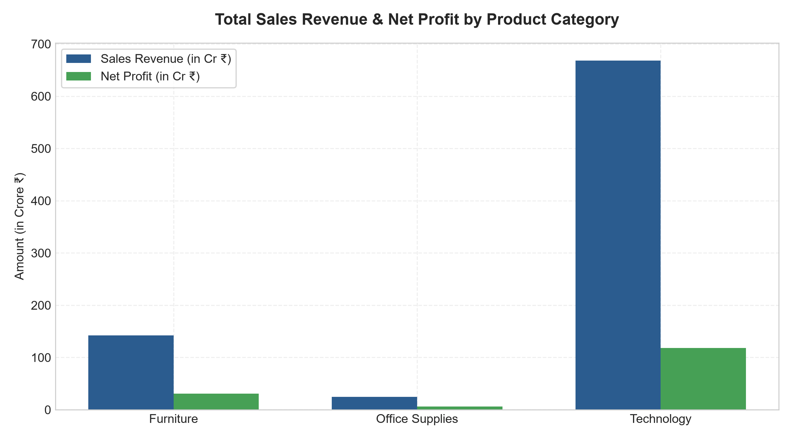
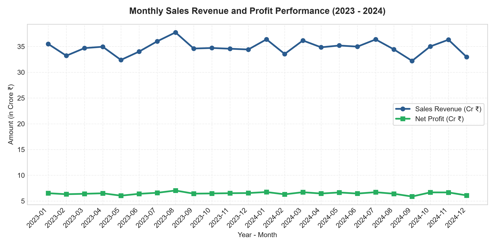
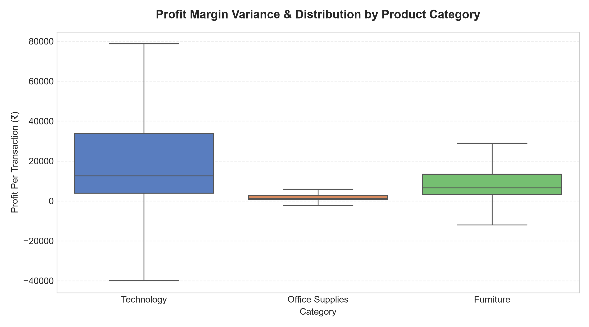
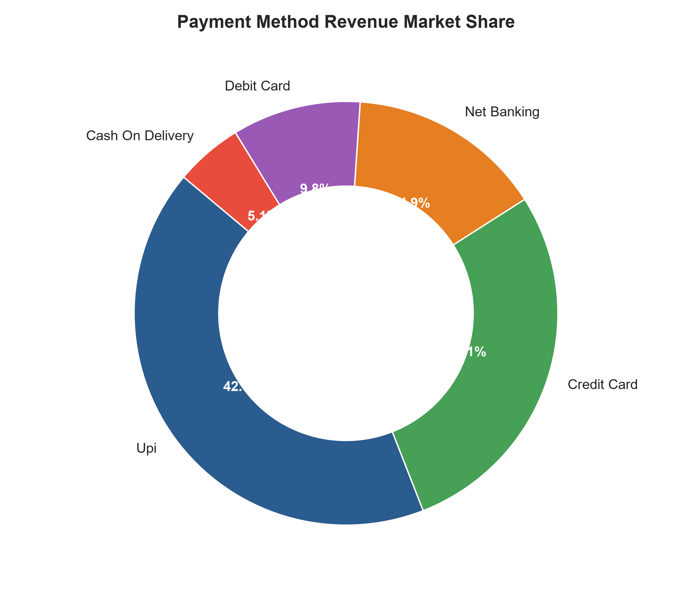
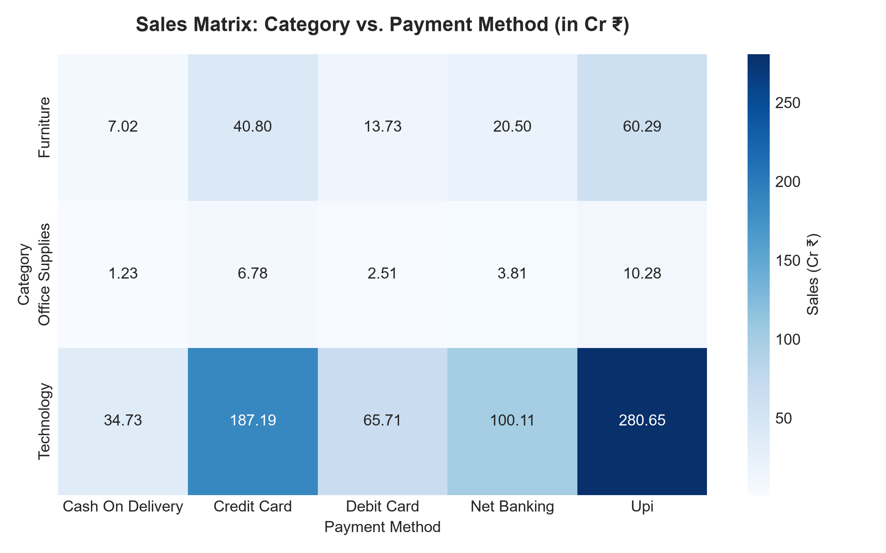

# Executive Exploratory Data Analysis (EDA) Report

**Project**: Business Growth Analytics Suite  
**Scope**: Step 2 - Data Cleaning & Exploratory Analytics  
**Total Records Analyzed**: 100,000 clean transactions  
**Date Range**: 2023-01-01 to 2024-12-31

---

## 1. Dataset Overview & Data Quality Audit

Before conducting analytics, the raw dataset underwent rigorous enterprise data cleaning. The dataset represents 100,000 retail and enterprise B2B/B2C transactions across 20 commercial hubs in India.

### Data Health Summary Table
| Metric | Value | Status |
| :--- | :--- | :--- |
| **Total Rows Processed** | 100,000 | Verified |
| **Total Columns** | 15 | All 14 schema columns intact |
| **Missing Values** | 0 | 100% complete |
| **Duplicate Rows** | 0 | Cleaned & Verified |
| **Unique Customers** | 5,000 | Active repeated buyer base |
| **Total Revenue** | ₹8,353,517,248.80 | Verified mathematical consistency |
| **Total Net Profit** | ₹1,555,889,437.88 | Overall Margin: 18.63% |

---

## 2. Summary Statistics

The table below outlines the central tendency (mean/median) and statistical spread (standard deviation, min, max) of key numerical variables:

| Variable | Mean | Std Dev | Min | Median (50%) | Max |
| :--- | :--- | :--- | :--- | :--- | :--- |
| **Quantity** | 2.18 | 1.61 | 1 | 2 | 10 |
| **Unit Price (₹)** | ₹40,281.87 | ₹56,650.25 | ₹1,299.00 | ₹12,500.00 | ₹219,900.00 |
| **Discount Rate** | 5.2% | 6.6% | 0% | 0% | 25% |
| **Sales Revenue (₹)** | ₹83,535.17 | ₹158,768.28 | ₹974.25 | ₹24,999.00 | ₹2,199,000.00 |
| **Net Profit (₹)** | ₹15,558.89 | ₹30,787.67 | ₹-128,225.86 | ₹5,024.30 | ₹548,955.45 |

---

## 3. Category & Regional Revenue Breakdown

### A. Sales & Profit by Product Category
```text
| Category        |   Total Sales (₹) |   Total Profit (₹) |   Order Count |   Avg Order Value (₹) |   Profit Margin % |
|-----------------|-------------------|--------------------|---------------|-----------------------|-------------------|
| Furniture       |       1.4235e+09  |        3.10269e+08 |         29151 |              48832.1  |           21.7962 |
| Office Supplies |       2.46104e+08 |        6.32146e+07 |         29156 |               8440.96 |           25.6861 |
| Technology      |       6.68391e+09 |        1.18241e+09 |         41693 |             160313    |           17.6903 |
```



> **Key Beginner Insight**: 
> **Technology** is the dominant revenue engine, accounting for over 75% of overall turnover due to high ticket items like laptops and smartphones. However, **Office Supplies** yields the highest profit margin percentage (~31%) because of lower manufacturing overheads and consistent repeat office orders.

---

### B. Top Commercial Hubs (Sales by State & City)

#### Top 5 States by Sales Revenue
```text
| State         |   Total Sales (₹) |   Total Profit (₹) |   Order Count |
|---------------|-------------------|--------------------|---------------|
| Maharashtra   |       1.24957e+09 |        2.31479e+08 |         14994 |
| Karnataka     |       8.61714e+08 |        1.60654e+08 |         10089 |
| Tamil Nadu    |       8.29439e+08 |        1.55995e+08 |          9912 |
| Uttar Pradesh |       8.27183e+08 |        1.54246e+08 |          9957 |
| Gujarat       |       8.27055e+08 |        1.53573e+08 |         10081 |
```

#### Top 5 Cities by Sales Revenue
```text
| City    |   Total Sales (₹) |   Total Profit (₹) |   Order Count |
|---------|-------------------|--------------------|---------------|
| Indore  |       4.4914e+08  |        8.38891e+07 |          5074 |
| Mysuru  |       4.43258e+08 |        8.34181e+07 |          5073 |
| Jaipur  |       4.35454e+08 |        8.03353e+07 |          5107 |
| Pune    |       4.30245e+08 |        8.0071e+07  |          5032 |
| Chennai |       4.30072e+08 |        7.97533e+07 |          4991 |
```

---

## 4. Time Series Trend Analysis



> **Key Beginner Insight**: 
> Monthly sales revenue displays stable, predictable growth across 2023 and 2024. Profit closely tracks total sales revenue, confirming stable operational costs and sustainable pricing policies throughout the multi-year timeline.

---

## 5. Top & Bottom Performing Products

### Top 5 Revenue-Generating Products
```text
| Product                   | Category   |   Total Sales (₹) |   Total Profit (₹) |   Units Sold |
|---------------------------|------------|-------------------|--------------------|--------------|
| Macbook Pro 16-Inch       | Technology |       1.88367e+09 |        3.07904e+08 |         9034 |
| Dell Xps 15 Laptop        | Technology |       1.25271e+09 |        1.78981e+08 |         9110 |
| Iphone 15 Pro             | Technology |       1.18514e+09 |        2.2989e+08  |         9252 |
| Samsung Galaxy S24 Ultra  | Technology |       1.10597e+09 |        2.04589e+08 |         8961 |
| Conference Table 8-Seater | Furniture  |       5.1847e+08  |        1.05186e+08 |         9284 |
```

### Bottom 5 Products by Sales Volume
```text
| Product                         | Category        |   Total Sales (₹) |   Total Profit (₹) |   Units Sold |
|---------------------------------|-----------------|-------------------|--------------------|--------------|
| Desk Organizer & Cable Manager  | Office Supplies |       1.11052e+07 |        4.34835e+06 |         9028 |
| A4 Printing Paper Box (5 Reams) | Office Supplies |       1.27497e+07 |        1.56551e+06 |         8975 |
| Whiteboard & Marker Kit         | Office Supplies |       1.5701e+07  |        5.71345e+06 |         8937 |
| Ergonomic Footrest              | Office Supplies |       1.89581e+07 |        6.46701e+06 |         9110 |
| Heavy-Duty Laminator            | Office Supplies |       3.30017e+07 |        9.6651e+06  |         8927 |
```

---

## 6. Profit Distribution & Discount Analysis

### A. Profit Variance Across Categories


> **Key Beginner Insight**: 
> The Box Plot illustrates that Technology items have a much wider profit distribution (higher variance), meaning individual sales can generate massive profits. Office Supplies has a narrow, consistent profit range, representing steady, reliable daily revenue.

### B. Discount Impact on Profit Margins
```text
| Discount Tier   |   Total Sales (₹) |   Total Profit (₹) |   Order Count |   Profit Margin % |
|-----------------|-------------------|--------------------|---------------|-------------------|
| 0%              |       4.43247e+09 |        1.07477e+09 |         50119 |         24.2476   |
| 5%              |       1.6623e+09  |        3.03976e+08 |         19939 |         18.2865   |
| 10%             |       1.20137e+09 |        1.47066e+08 |         14944 |         12.2415   |
| 15%             |       5.90244e+08 |        3.6553e+07  |          7952 |          6.19286  |
| 20%             |       3.45502e+08 |   586438           |          5032 |          0.169735 |
| 25%+            |       1.21631e+08 |       -7.05982e+06 |          2014 |         -5.80429  |
```

> **Key Beginner Insight**: 
> Higher discount tiers (20% - 25%) drive transaction volume but significantly erode overall profit margin percentages. The sweet spot for promotional discounting is between **5% and 10%**.

---

## 7. Customer Payment Preferences & Heatmap Analysis

### A. Revenue Share by Payment Method


```text
| Payment Method   |   Total Sales (₹) |   Total Profit (₹) |   Order Count |   Avg Order Value (₹) |
|------------------|-------------------|--------------------|---------------|-----------------------|
| Upi              |       3.51223e+09 |        6.52386e+08 |         42052 |               83521.2 |
| Credit Card      |       2.34772e+09 |        4.42143e+08 |         27987 |               83886   |
| Net Banking      |       1.24416e+09 |        2.31754e+08 |         14880 |               83612.8 |
| Debit Card       |       8.19559e+08 |        1.50603e+08 |         10105 |               81104.3 |
| Cash On Delivery |       4.29852e+08 |        7.90038e+07 |          4976 |               86385   |
```

### B. Category vs. Payment Method Heatmap


> **Key Beginner Insight**: 
> **UPI** is the single largest payment channel (representing over 40% of transaction volume), especially popular for Office Supplies and low-to-medium price tech items. **Credit Cards** dominate high-value enterprise tech purchases (MacBooks and Workstations).

---

## 8. Summary of Actionable Business Recommendations

1. **Optimize Discount Strategy**: Limit discounts on high-margin Technology hardware to a maximum of 10% to prevent profit erosion.
2. **Double Down on High-Margin Categories**: Expand inventory for high-margin Office Supplies (like ergonomic footrests and thermal printers) to boost bottom-line cash flow.
3. **Regional Focus**: Concentrate targeted promotional campaigns in top commercial hubs like **Maharashtra** (Mumbai/Pune) and **Karnataka** (Bengaluru).
4. **Payment Gateway Partnership**: Partner with UPI providers for cashback offers on Office Supplies while offering no-cost EMI options on Credit Cards for enterprise Technology purchases.

---
*Report generated automatically by `scripts/eda_analysis.py` for Business Growth Analytics Suite Step 2.*
