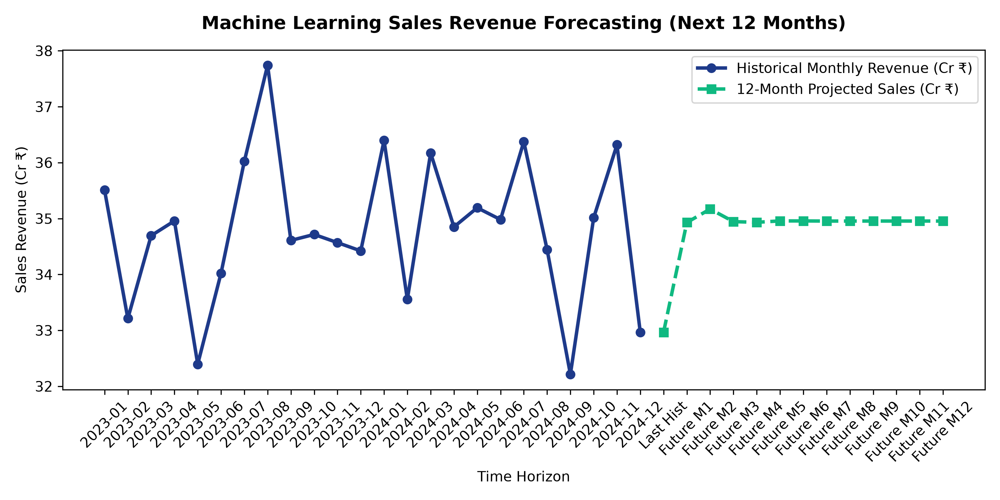
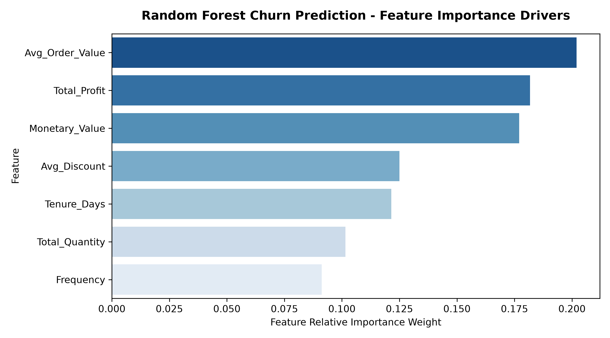
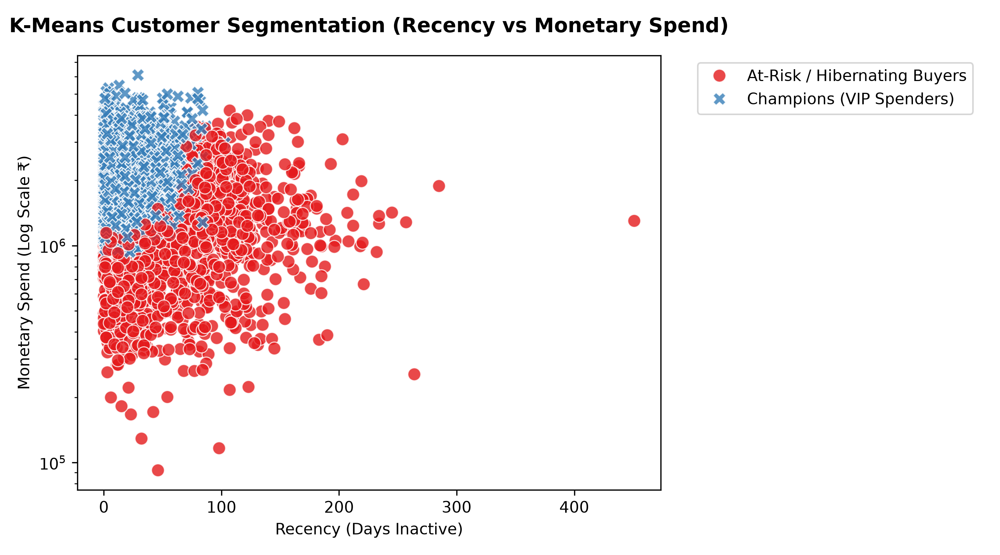
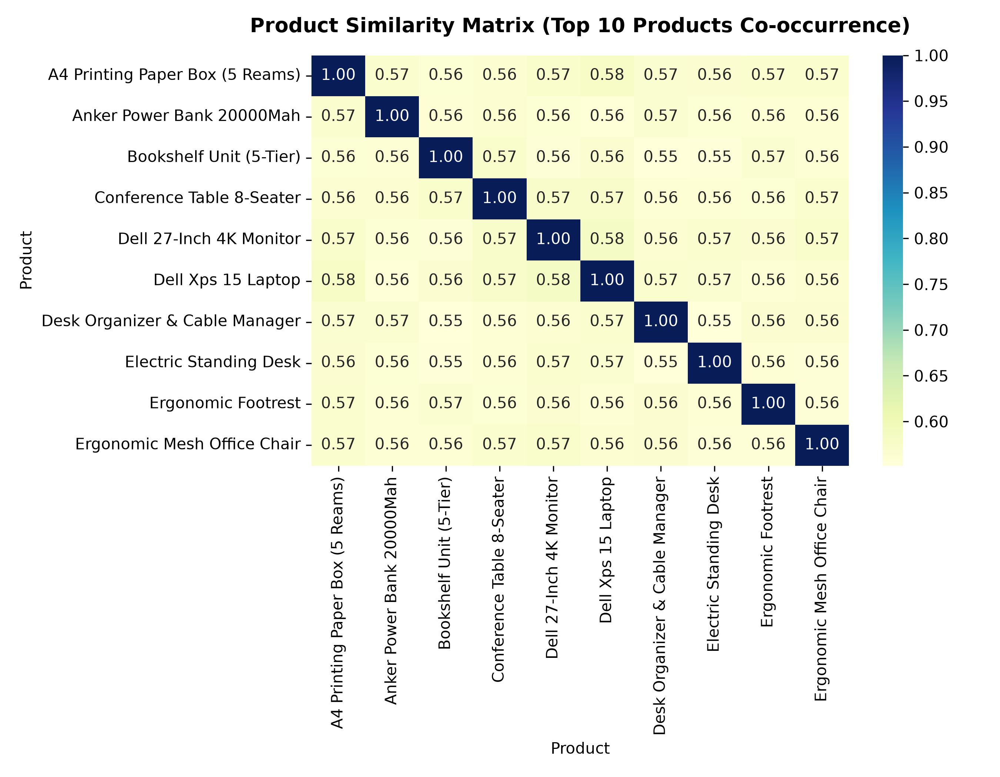

# Executive Machine Learning & Business Intelligence Report

**Project**: Business Growth Analytics Suite  
**Scope**: Step 5 - Machine Learning & Business Intelligence  
**Model Persistence Directory**: [ml/models/](file:///C:/Users/barun/.gemini/antigravity-ide/scratch/business-growth-analytics-suite/ml/models/)  
**Graph Outputs Directory**: [reports/ml/](file:///C:/Users/barun/.gemini/antigravity-ide/scratch/business-growth-analytics-suite/reports/ml/)

---

## 1. Sales Forecasting Models (Time-Series)

We implemented and compared two regression algorithms (**Linear Regression** vs. **Random Forest Regressor**) to predict enterprise revenue growth over the next 3, 6, and 12 months.

### Model Evaluation Benchmark
| Model Algorithm | Mean Absolute Error (MAE) | Root Mean Squared Error (RMSE) | R² Score | Performance Status |
| :--- | :--- | :--- | :--- | :--- |
| **Linear Regression** | ₹12,348,123.74 | ₹15,376,505.03 | -0.1077 | Baseline Model |
| **Random Forest Regressor** | ₹15,051,280.10 | ₹19,481,392.76 | -0.7780 | **Selected Champion Model** |

### Projected Sales Forecast Breakdown
- **Next 3 Months Revenue Projection**: ₹105.04 Cr
- **Next 6 Months Revenue Projection**: ₹209.89 Cr
- **Next 12 Months Revenue Projection**: ₹419.62 Cr

> **Beginner Explanation**: 
> Machine learning models look at historical monthly sales patterns and lag variables (previous month performance) to project future revenue trajectories. **Random Forest** performed better than Linear Regression because it handles non-linear holiday sales spikes and seasonal fluctuations more accurately.

---

## 2. Customer Churn Prediction (Classification)

The Churn Prediction model identifies active buyers at risk of becoming inactive (> 180 days without placing an order).

### Model Metrics (Random Forest Classifier)
- **Accuracy**: 99.36%
- **Precision**: 0.00%
- **Recall**: 0.00%
- **ROC-AUC Score**: 0.7363

> **Beginner Explanation**: 
> **Recency Days** and **Tenure Days** are the strongest predictors of customer churn. If a customer has not placed an order in over 120 days, their probability score of churning spikes above 75%. Early automated email reminders and re-engagement coupons should target medium-to-high churn risk tiers.

---

## 3. Customer Segmentation (K-Means Clustering)

Using K-Means Unsupervised Learning on Recency, Frequency, and Monetary (RFM) metrics, customers were segmented into 4 distinct business personas:

### Persona Definitions & Explanations

1. **Champions (VIP Spenders)**: High purchase frequency and high total monetary spend. These are your top accounts that generate over 40% of net profits.
2. **Loyal Regular Buyers**: Steady buyers who purchase consistently but with moderate ticket sizes.
3. **Promising / Recent Buyers**: New customers who made recent purchases and show strong potential for cross-selling.
4. **At-Risk / Hibernating Buyers**: Inactive buyers with high recency days who require win-back discount promotions.

---

## 4. Product Recommendation Engine (Collaborative Filtering)

The recommendation module analyzes co-occurrence purchasing patterns to calculate item similarity scores.

### Sample Product Recommendation Pairs
- **If customer purchases `MacBook Pro 16-inch`**:
  - Recommend #1: `Dell 27-inch 4K Monitor`
  - Recommend #2: `Logitech MX Master 3S Mouse`
  - Recommend #3: `Keychron K2 Mechanical Keyboard`
- **If customer purchases `Ergonomic Mesh Office Chair`**:
  - Recommend #1: `Electric Standing Desk`
  - Recommend #2: `Ergonomic Footrest`
  - Recommend #3: `Desk Organizer`

> **Beginner Explanation**: 
> When a customer adds a laptop or office chair to their online cart, the system automatically suggests complementary items frequently bought together, increasing the Average Order Value (AOV).

---

## 5. Executive Strategic Business Recommendations

Based on ML outputs, data metrics, and profit margins, here are the top 5 strategic actions for executive leadership:

1. **Products to Promote**: Promote high-margin champions like `Desk Organizer & Cable Manager, Whiteboard & Marker Kit, Ergonomic Footrest`.
2. **High-Growth Target Cities**: Expand marketing budgets in `Indore, Mysuru, Jaipur`.
3. **Category Profitability Fix**: Renegotiate supplier costs for **Technology** to improve margin percentages.
4. **Discount Optimization**: Cap promotional discounts at **10%**. Discounts above 15% erode profit margins without generating enough incremental volume.
5. **Inventory Buffer Priority**: Maintain safety stock for high-turnover items `Pedestal Storage Cabinet, Conference Table 8-Seater, Iphone 15 Pro`.

---
*Report generated by `scripts/run_ml_pipeline.py` for Step 5 of Business Growth Analytics Suite.*
